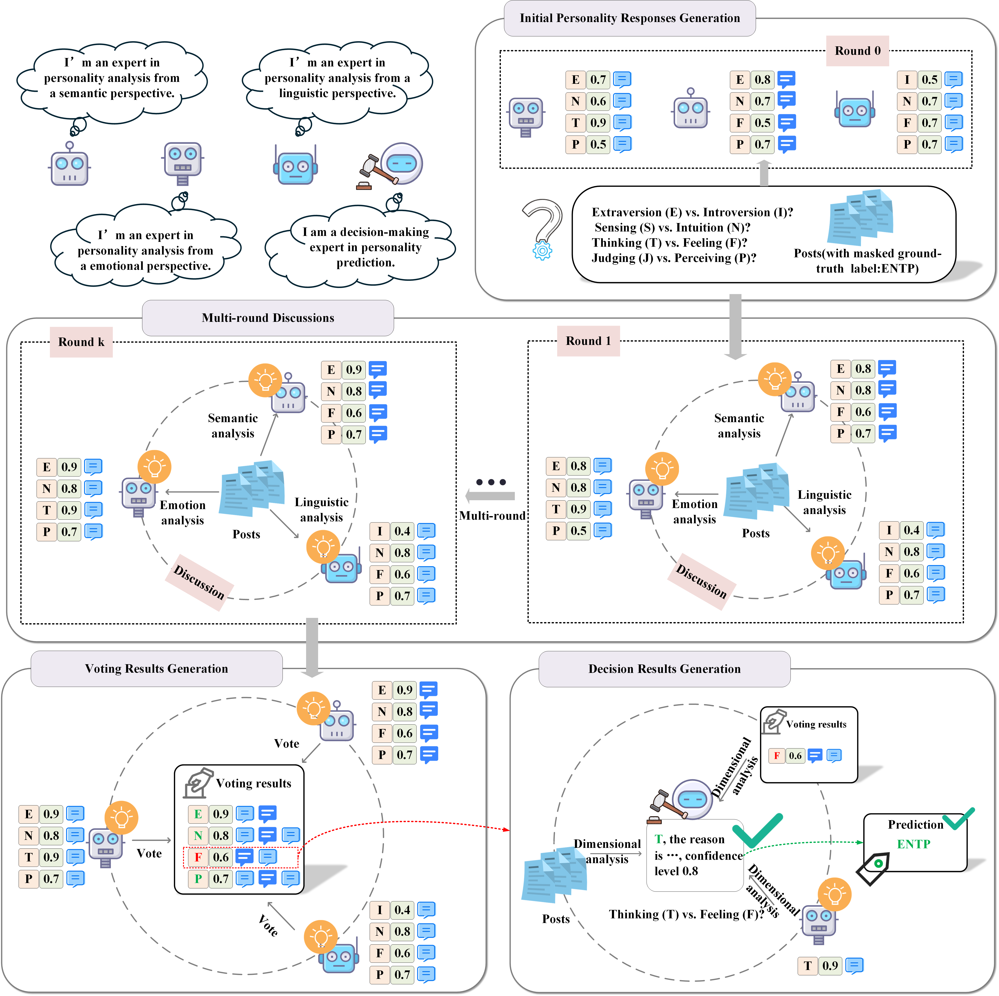
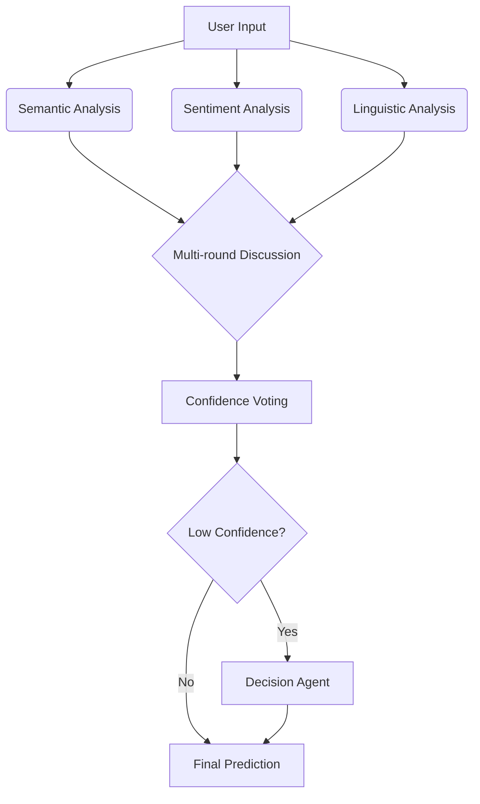
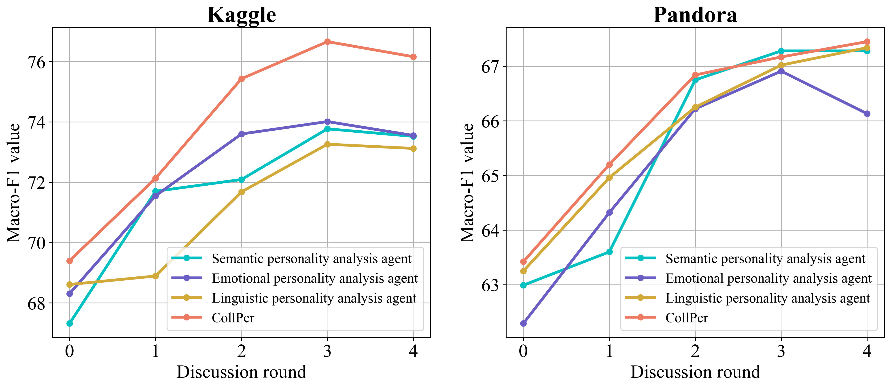

# CollPer: LLM Agents Collaboration for Personality Detection



## 📖 Introduction
**CollPer** is a novel framework that leverages collaborative LLM agents for personality detection, inspired by human sociological principles of division of labor and group decision-making. Our method achieves state-of-the-art performance on MBTI personality prediction tasks through:

- **Multi-perspective Analysis**: Three specialized agents (Semantic, Sentiment, Linguistic)
- **Dynamic Group Discussions**: Multi-round knowledge exchange between agents
- **Confidence-aware Voting**: Adaptive decision-making for low-confidence predictions

## 🚀 Key Features
- **Multi-Agent Collaboration System**
- **Domain-Specific Analysis Prompts**
- **Automatic Confidence Calibration**
- **Early Consensus Detection**
- **Extensible Architecture**

## 📦 Installation
```bash
pip install -r requirements.txt
```

Required packages:
```python
autogen==0.2.2
tenacity==8.2.3
regex==2023.12.25
python-dotenv==1.0.0
```

## 🧠 Model Architecture
### Core Components
1. **Personality Analysis Agents**
   - Semantic Analyst
   - Sentiment Analyst 
   - Linguistic Analyst
2. **Discussion Coordinator**
3. **Voting Mechanism**
4. **Decision Maker**

### Workflow


## 💻 Usage
### Basic Inference
```python
from functionals.analysis import mbti_analysis

if __name__ == '__main__':
    """
    start&end: the index of the dataset
    dataset: 'kaggle' or 'mbti' the dataset, each dataset gets 1000 samples
    types: 
        0 : default type
        4 : run with only one agent
        6 : run with muti-round discussion and no confidence voting
        8 : run with two-agent
        9 : run with one agent who has the ability to rethink
    """
    mbti_analysis(start=0, end=100, dataset='kaggle', types=0)

```


## 📊 Results Reproduction
### Benchmark Performance
| Dataset   | I/E  | S/N  | T/F  | P/J  | Avg. |
|----------|-------|-------|-------|-------|-------|
| Kaggle   | 66.11 | 81.64 | 85.10 | 73.78 | 76.66 |
| Pandora  | 59.87 | 62.65 | 75.22 | 72.08 | 67.45 |

### Ablation Studies

